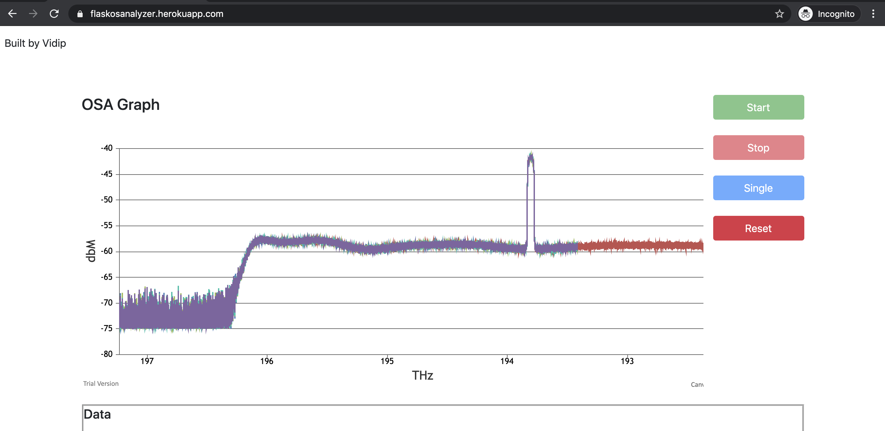

# virtualosa
Virtual Cloud Optical Spectrum Analyzer

Production Url: https://flaskosanalyzer.herokuapp.com/

Demo Video: https://drive.google.com/file/d/1KyP25wWSMq0csyY2vKs1Y0XgO_9_fORj/view?usp=sharing

Technologies Used: Python (Flask), Javascript, Jquery, Canvas Js, HTML, CSS.

Steps to Run the Project

1. pip3 install -r requirements.txt (This will install all the required packages)
2. python3 app.py

You can open http://127.0.0.1:5000/ to open the page.

API to get command output: /postcommand/<Command>
  
  For Example: https://flaskosanalyzer.herokuapp.com/postcommand/IDN
 
Screenshots:

When Clicked on Single Button

Echo Example: In Command Box just input ECHO 'any string'

Example: ECHO hello world

On Click of Start Button, it refreshes the data every second. Following is the screenshot of when clicked on single.

Features

1. START button will start the acquisition rate and will refresh after every 1 second as it has 1Hz of refresh rate.
2. STOP button will stop the acquisition and graph rendering will stop.
3. SINGLE retrieves a single trace and graph will be displayed.
4. User can call the above mentioned apis to send different commands as required. (using url/postcommand/IDN)
5. Input field is given where can command can entern commands as given in the problem statement. Example mentioned above. 
6. User can also change the limits if required, Change Limit button will auto enable whenever LIM is typed.

User can give max and min limits in the input type.

Extra Functionalities:

1. User can zoom in, out, pan the plot, undo the graph.
2. Values can be read off the graph in the table as well.
3. Deployed app to Heroku
4. Provides plot persistence

All the graph populating and other element interaction event logic is in index.js
Backend logis is in app.py
Blueprints are made for posting commands and getting output in command.py

Command	Description
/cmd	returns command prompt

/cmd/IDN	returns device identification string

/cmd/LIM	returns x-axis limits in m

/cmd/LIM/[min max]	sets x-axis limits in nm

/cmd/ECHO/string	Emulates query command and sends a string to API, will get the same string back

/cmd/PING	Returns PONG

/cmd/START	sets instrument state to continues acquisition

/cmd/STOP	sets instrument state to IDLE

/cmd/SINGLE	starts a single scan (blocking operation, single scan takes few seconds)

/cmd/STATE	returns instrument state

/cmd/TRACE	returns OSA trace in json format

