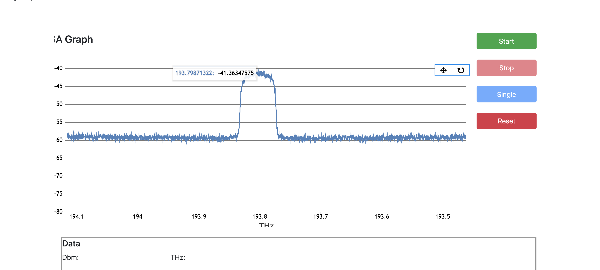

# virtualosa
Virtual Cloud Optical Spectrum Analyzer

Production Url: https://flaskosanalyzer.herokuapp.com/

Technologies Used: Python (Flask), Javascript, Jquery, Canvas Js, HTML, CSS.

Steps to Run the Project

1. pip3 install -r requirements.txt (This will install all the required packages)
2. python3 app.py

API to get command output: /postcommand/<Command>
  
  For Example: https://flaskosanalyzer.herokuapp.com/postcommand/IDN
 
Screenshots:

Echo Example: In Command Box just input ECHO 'any string'

Example: ECHO hello world

On Click of Start Button, it refreshes the data every second.

